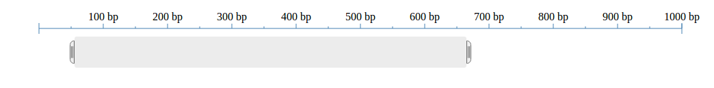

polymer-region-selector
=======================

A widget that selects max and min bounds on a genomic sequence of a given length. This is my first forey into Dart and Polymer, so expect things to change.

Usage
-----

Usage is pretty easy. In the header, include:

    <link rel="import" href="../lib/region_selector.html">

Somewhere in your html, put something like

    <region-selector id="my-selector" totalLength="1000"></region-selector>

This will render something like:

Features
--------
The region-selector element draws the draggable bar and the scale at the top. The scale spacing is all calculated for you and should readjust on window resize.

TODO
----
It would be nice if the user had control over the styling (if they wanted), so a future version might pick out elements from the light dom (svg elements enclosed in the <region-selector>) and move them according to the selected bounds.

I'd also like the scale to be optional by adding a true/false attribute.

